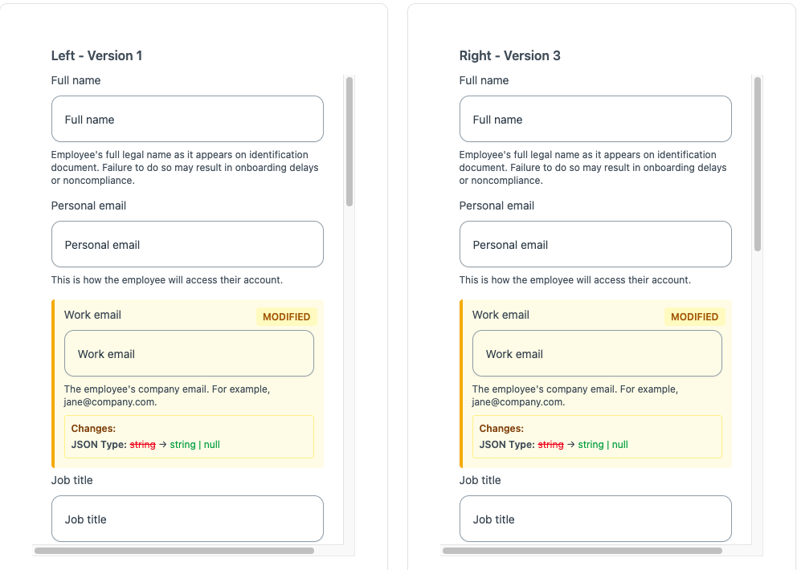

# MIGRATING EOR COUNTRIES

The `<OnboardingFlow />` supports different json schema versions, at the moment the default version the component renders is 1 for the basic_information step, contract_details and benefits.

## Basic Information

This schema is the same for all countries to update the schema to the latest version you do this in the code

```tsx
<OnboardingFlow
  companyId={companyId}
  type={type}
  render={OnBoardingRender}
  employmentId={employmentId}
  externalId={externalId}
  options={{
    jsonSchemaVersion: {
      employment_basic_information: 3, // updates json-schema to version v3
    },
  }}
/>
```

To see the changes you can check them on the next [md file](./schema-changes/eor/basic-information/v3/v3.md) or you can use the [json visualizer](https://remote-flows-eight.vercel.app/?demo=json-schema-comparison) to check the differences



## Contract Details

Each country has a different schema and follows a different versioning, the index file is located [here](./schema-changes/eor/contract-details/countries/README.md)

I recommend checking each changelog separately and using the [diff tool](https://remote-flows-eight.vercel.app/?demo=json-schema-comparison) to understand quickly what has changed

```tsx
<OnboardingFlow
  companyId={companyId}
  type={type}
  render={OnBoardingRender}
  employmentId={employmentId}
  externalId={externalId}
  options={{
    jsonSchemaVersion: {
      employment_basic_information: 3,
    },
    jsonSchemaVersionByCountry: {
      GBR: {
        // United Kingdom
        contract_details: 2,
      },
      PRT: {
        // Portugal
        contract_details: 3,
      },
    },
  }}
/>
```

## FAQ

### How do I get access to the json diff visualizer?

The visualizer is password-protected. Contact the Remote team to request access credentials.

### What if a country isn't listed in the migration guide?

The country is using the default v1 schema. Check the [countries README](./schema-changes/eor/contract-details/countries/README.md) for the complete list.
